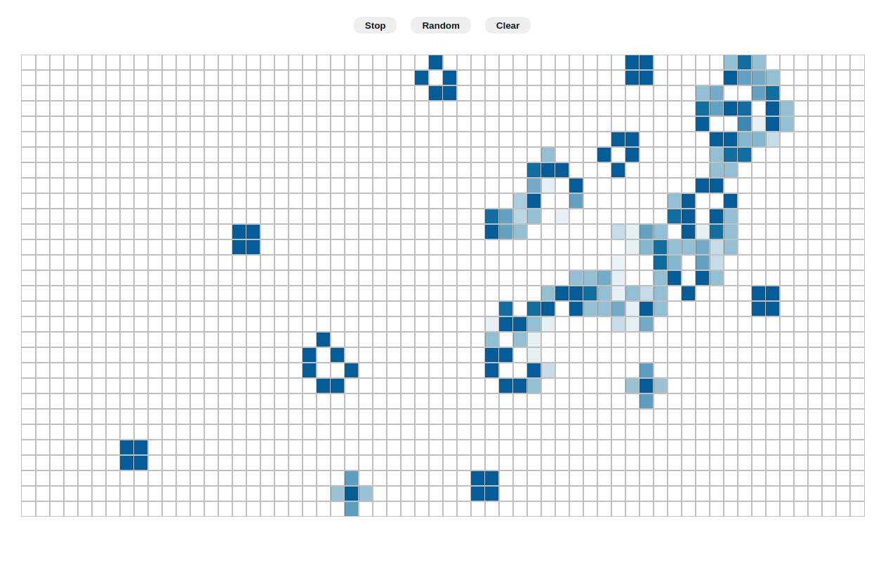

# Conway's Game of Life

Simple visualization of Conway's game "Game of Life" made with React and Typescript.



## Install on your local machine

1. Clone the code on your local machine:
```sh
git clone git@github.com:JavierPoduje/Game-of-life.git
```

2. Install node packages:
```sh
yarn install
```

3. Run the code:
```sh
yarn start
```

4. Enjoy!


